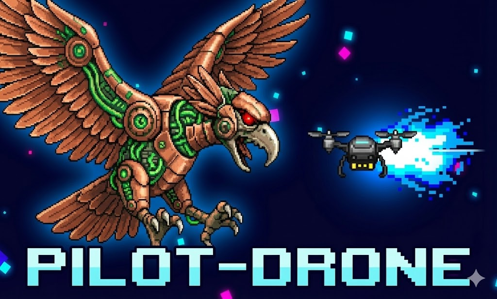

# 🕹️ AQUILA: Pilot Drone - Sky Vengeance

 
<!-- Cambia "portada.png" por el nombre real de tu imagen o por un URL directo -->

---

## 🎮 Descripción

*AQUILA: Sky Vengeance* es un shooter arcade inspirado en los clásicos del género.  
Pilota una nave experimental y enfréntate a **Aquila**, un dios-máquina con forma de águila biomecánica que domina los cielos.

Esquiva proyectiles, destruye oleadas de enemigos y sobrevive a jefes mecánicos en un mundo retro con efectos modernos.

---

## 🌐 Jugar en la Web

Puedes jugar directamente en tu navegador gracias al build WebGL:

👉 **[Jugar Online en](https://play.unity.com/en/games/dc1b3c92-895f-43b8-9b85-251564117169/pilot-drone-r-type-sky-vengeance)**  

No requiere instalación.

---

INSTRUCCIONES PARA REPRODUCIR EL BUILD WEBGL (LOCAL)

1.  Ir a la carpeta “docs”.
2.  Ejecutar un servidor local porque WebGL no abre con doble clic.

OPCIÓN 1: Python cd docs python -m http.server 8000 Abrir:
http://localhost:8000

OPCIÓN 2: VS Code + Live Server Click derecho en index.html → Open with
Live Server

OPCIÓN 3: Node.js npm install -g http-server cd docs http-server

------------------------------------------------------------------------

CÓMO ABRIR EL PROYECTO EN UNITY

1.  git clone https://github.com/TU-USUARIO/Drone-Pilot—Demo.git
2.  Abrir Unity Hub → Open Project
3.  Requisitos:
    -   Unity 2021.x (o versión que uses)
    -   WebGL Build Support
4.  File → Build Settings → WebGL → Build

------------------------------------------------------------------------

ARTE Y ESTILO - Fondo espacial con partículas retro - Jefe: águila
biomecánica metálica - Nave futurista con propulsión azul

------------------------------------------------------------------------

TECNOLOGÍAS - Unity (C#) - WebGL - GitHub Pages

------------------------------------------------------------------------

CRÉDITOS Desarrollado por: Javier CR (Shan-JCB) Año: 2025
